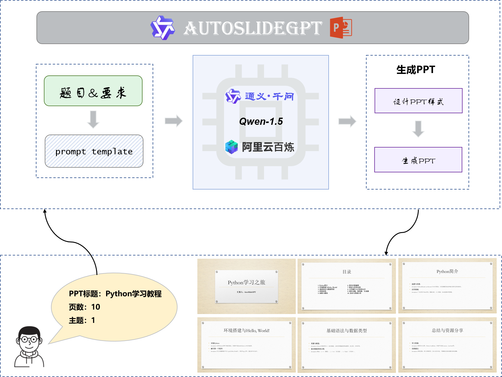
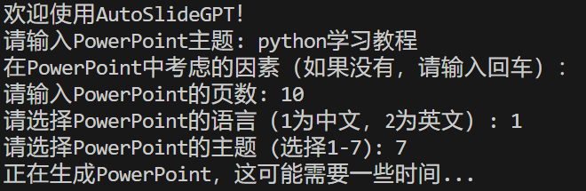
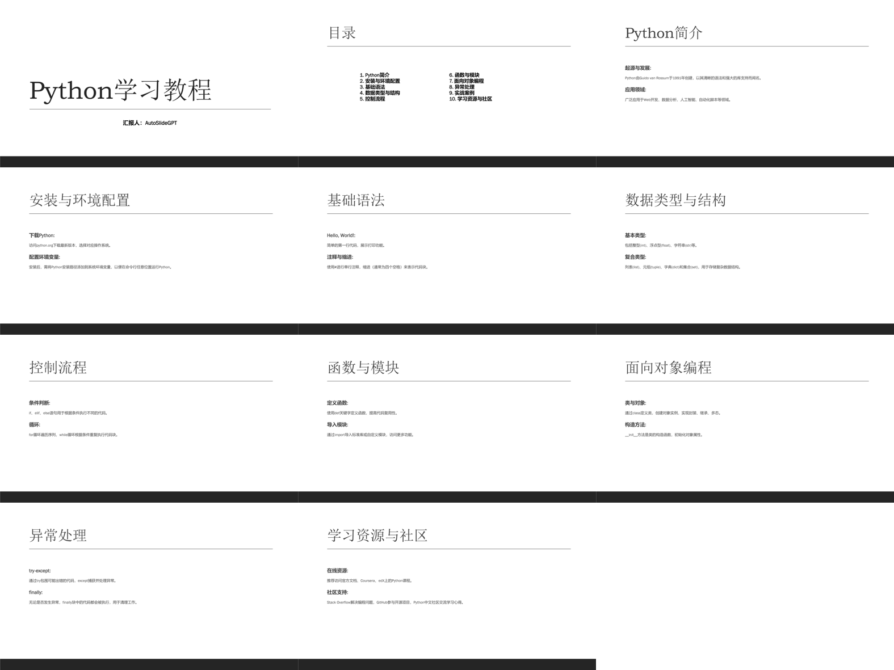

<div align="center">

# AutoSlideGPT - 基于大语言模型的智能PPT生成工具

</div>


# 一、👋介绍 

随着大语言模型（LLM）的快速发展，基于自然语言处理的生成式工具在各个领域展现出巨大潜力。AutoSlideGPT 是一个基于大语言模型的智能PPT生成工具，旨在通过简化繁琐的PPT制作过程，提高用户的工作效率。在许多场景中，制作PPT是一项耗时且重复性较高的任务，尤其是对于需要频繁制作展示文稿的用户，如教师、商务人士和研究人员。AutoSlideGPT 利用大语言模型的强大生成能力，自动分析输入内容，并生成逻辑清晰、结构合理的幻灯片，帮助用户快速完成PPT制作。

本项目致力于提供一个易用、高效的解决方案，使用户能够专注于内容创作，而无需花费大量时间进行格式排版或结构设计。通过持续优化模型表现，AutoSlideGPT 将不断提升生成PPT的质量与实用性，助力用户在各类演示场景中展现出色的表达效果。

本项目实现了一个基于大语言模型的自动PPT生成工具，用户通过输入主题与要求(页数，PPT风格，语言)，大语言模型自动生成内容匹配PPT模板。

# 二、🛠️AutoSlideGPT模型框架 

## 2.1 模型框架



该模型通过输入题目及要求，将题目及要求与prompt模板融合给到`Qwen1.5-110b-Chat`模型生成PPT内容，将内容解析并通过python-pptx与提前设计好的PPT样式最终生成PPT。

## 2.2 效果展示

```
python AutoSlideGPT.py
```





# 三、📑使用说明

## 3.1 克隆项目

```bash
git clone https://github.com/JiaxingSong718/AutoSlideGPT.git

cd AutoSlideGPT
```

## 3.2 安装依赖

本项目推荐使用`python 3.10`，过老的python版本可能不兼容所依赖的第三方库。  

pip安装：

```bash
pip install -r ./requirements.txt
```

## 3.3 添加API-KEY 

在`.env`文件中添加你的阿里云百炼API-KEY，具体的申领方式见网上博客。

```
API_KEY = your api-key
```

## 3.4 使用AutoSlideGPT

运行AutoSlideGPT：

```
python AutoSlideGPT.py
```

输入你的要求，即可在`GeneratedPresentations`生成相应的PPT文件，`Cache`文件夹中保存大模型的返回结果。

# 四、🎓引用

如果你觉得本项目对你有所帮助，欢迎引用。

```conf
@misc{AutoSlideGPT2024,
    author={Charent Chen},
    title={AutoSlideGPT-Intelligent Slide Generation Tool Based on Large Language Models},
    year={2024},
    publisher = {GitHub},
    journal = {GitHub repository},
    howpublished = {\url{https://github.com/JiaxingSong718/AutoSlideGPT}},
}
```

# 五、🤔其他事项

本项目不承担开源模型和代码导致的数据安全、舆情风险或发生任何模型被误导、滥用、传播、不当利用而产生的风险和责任。

